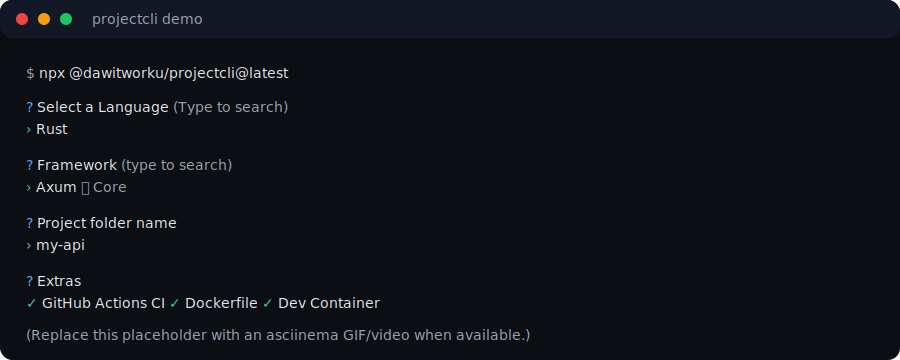

# ProjectCLI 🚀

<!-- TODO: Replace this with a real asciinema GIF/video -->

**Demo (2 minutes):**

- Play locally: `asciinema play docs/demo.cast`
- Or convert to GIF and replace the image below

> Want to upgrade this to a real recording? Record with `asciinema rec` and convert to GIF.
> Then replace the placeholder at `docs/demo.svg` (or switch the link back to a GIF).



Asciinema recording file: `docs/demo.cast`

> **The Swiss Army Knife for Project Scaffolding.**  
> Bootstrapping new projects shouldn't require memorizing 50 different CLI commands.

[](https://opensource.org/licenses/MIT)
[](https://badge.fury.io/js/@dawitworku%2Fprojectcli)
[](http://makeapullrequest.com)

**ProjectCLI** is an interactive, cross-language project generator. Instead of remembering usage for `create-react-app`, `cargo new`, `poetry new`, `laravel new`, `rails new`, etc., just run `projectcli`.

We handle the complexity of calling the official CLIs for you.

## 🤔 Why ProjectCLI?

| Tool             | Problem                     |
| ---------------- | --------------------------- |
| create-react-app | JS-only                     |
| cargo new        | Rust-only                   |
| yeoman           | heavy & old                 |
| projectcli       | **unified + context-aware** |

## ✨ Features

- **Multi-Language Support**: Rust, Go, Python, JavaScript, TypeScript, PHP, Java, C#, Ruby, Swift, Dart.
- **Unified Interface**: One interactive wizard to rule them all.
- **Smart Context Awareness**: Running `projectcli` inside an existing project automatically offers to add libraries, CI/CD, or Dockerfiles tailored to that language.
- **Preflight Checks**: Warns you if you are missing required tools (e.g. `cargo`, `go`, `node`) before you start.
- **Remote Templates**: Clone any GitHub repository and automatically strip `.git` history for a fresh start.
- **CI/CD & Docker**: One-click generation of GitHub Actions workflows and Dockerfiles.
- **Dev Containers**: Generate `.devcontainer/devcontainer.json` for VS Code / Codespaces.
- **License Generator**: Add a standard `LICENSE` file (configurable default).

## ✅ Safety Guarantees

- ❌ Never writes outside the project folder it creates (guards against path traversal).
- ❌ Never deletes files without an explicit, targeted operation (template clone only removes the cloned `.git`).
- ✔ Supports `--dry-run` to preview planned actions without executing them.

## 🚀 Quick Start

Run instantly with `npx`:

```bash
npx @dawitworku/projectcli@latest
```

Or install globally:

```bash
npm install -g @dawitworku/projectcli
projectcli
```

## 🎮 Interactive Mode

Just run `projectcli` and follow the prompts:

1. Select **Language** (fuzzy search supported).
2. Select **Framework** (React, Vue, Next.js, Actix, Axum, Django, FastAPI, etc.).
3. Choose **Project Name**.
4. (Optional) Add **CI/CD** or **Docker**.

## 🛠 Advanced Usage

### Context Awareness

Run it inside a project to detect the language and offer relevant tools:

```bash
cd my-rust-project
projectcli
# Output: "✓ Detected active Rust project"
# Options: [Add GitHub Actions CI], [Add Dockerfile], [Add Dependencies]
```

### Remote Templates

Clone a starter kit from GitHub and make it your own instantly:

```bash
projectcli --template https://github.com/example/starter-repo --name my-app
```

You can also apply extras non-interactively:

```bash
projectcli --template https://github.com/example/starter-repo --name my-app --yes --ci --docker --devcontainer --license
```

### Automation / CI Use

Skip the interactive prompts for scripts or specialized workflows:

```bash
projectcli --language Rust --framework Actix --name my-api --ci --docker --yes
```

Preview what would happen (no execution):

```bash
projectcli --language Rust --framework Actix --name my-api --dry-run
```

Extras flags:

- `--devcontainer` add a VS Code Dev Container
- `--license` force-add LICENSE (uses config defaults)
- `--no-license` never add LICENSE

### Configuration

Save your preferences (like default package manager):

```bash
projectcli config
```

You can set defaults like:

- JS/TS package manager
- Author name (for LICENSE)
- Default license type (MIT/Apache2/ISC)

### Project Config File (teams / automation)

ProjectCLI can also read a config file from the current directory:

- `.projectclirc`
- `projectcli.config.json`

Example:

```json
{
  "packageManager": "pnpm",
  "author": "The Team",
  "license": "MIT",
  "ci": true,
  "docker": false,
  "devcontainer": true
}
```

Precedence:

1. CLI flags
2. Project config file
3. Global config (`projectcli config` → `~/.projectcli.json`)

## 📦 Supported Generators (Partial List)

| Language                  | Frameworks / Tools                                            |
| ------------------------- | ------------------------------------------------------------- |
| **JavaScript/TypeScript** | React (Vite), Vue, Next.js, NestJS, Express, Astro, Svelte... |
| **Rust**                  | Binary, Library, Actix Web, Axum, Rocket, Taurus...           |
| **Python**                | Poetry, Setuptools, Django, Flask, FastAPI...                 |
| **Go**                    | Binary, Fiber, Gin, Chi, Echo...                              |
| **PHP**                   | Laravel, Symfony, Slim...                                     |
| **Java/Kotlin**           | Spring Boot, Gradle/Maven...                                  |
| **...and more**           | C#, Ruby, Swift, Dart                                         |

## 🧱 Architecture (for contributors)

ProjectCLI is intentionally simple: most “features” are data-driven.

- **Registry**: generators live in `src/registry.js` as `(Language -> Framework -> generator)` entries.
- **Generators produce steps**: each generator returns a list of steps (commands / mkdir / writeFile).
- **Executor**: steps are executed by `src/run.js` (it also prevents writing outside the project folder).
- **Preflight**: generators can declare required tools with `check: ["cargo", "go", ...]` and the wizard warns early.
- **Remote templates**: `--template` clones via `src/remote.js`, strips `.git`, then can apply Extras (CI/Docker/Devcontainer/License).

Adding a framework usually means:

1. Add an entry in `src/registry.js` with `id`, optional `notes`, optional `check`, and a `commands()` function.
2. Prefer non-interactive CLI args where possible (better for `--yes`/automation).
3. Run `npm run lint` and `npm test`.

## 🤝 Contributing

We love contributions! Whether it's adding a new framework to the registry or fixing a bug.

1.  Fork it.
2.  Create your feature branch (`git checkout -b feature/new-framework`).
3.  Commit your changes (`git commit -am 'Add support for X'`).
4.  Push to the branch (`git push origin feature/new-framework`).
5.  Create a new Pull Request.

See [CONTRIBUTING.md](CONTRIBUTING.md) for more details.

## 📝 License

MIT © [Dawit Worku](https://github.com/dawitworku)
